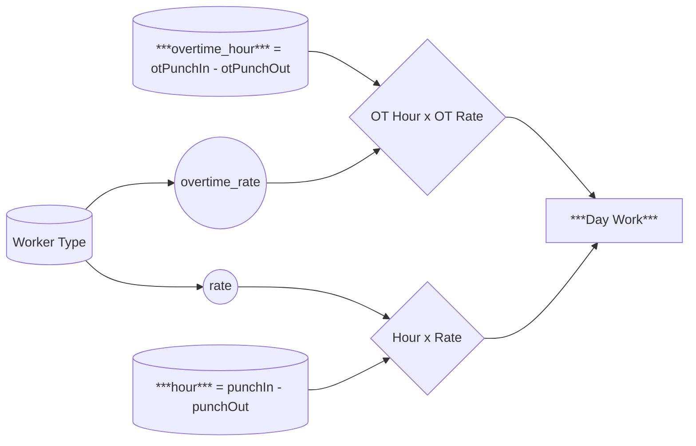

Serves as the basis on how much the worker are paid. No changes should be made to the rate on the 6th of each month onward in order to avoid messing with Permit calculations. Day Work calculation payout should be complete on the 1st of each month.


1. Identify the Worker Rate and Overtime Rate from Worker Type
2. Determine the hours logged from the difference in **Punch In** to **Punch Out** and difference of ***Overtime Punch In*** and ***Overtime Punch Out*** 
3. Multiply each respectively and sum for the Day Work.$$ dayWork = overtimeRate * (overPunchIn - overPunchOut) + rate * ( punchOut - punchIn) $$
```php
pulibc function CalculateWorkerDayWork($arr_day_work) {
	if(empty($arr_day_work['hour']) && empty($arr_day_work['worker_rate'])) {
		$session->setFlash('Error', 'No worker hour and rate found!');
		return;
	}
	else {
		$day_work = $arr_day_work['hour'] * $arr_day_work['worker_rate'];
	}
	if(!empty($arr_day_work['over_time_hours'])) {
		$rate = empty($arr_day_work['worker_overtime_rate']) ? $arr_day_work['worker_rate'] : $arr_day_work['worker_overtime_rate'];
		$day_work += $arr_day_work['overtime_hour'] * $rate;
	}
	return $day_work;
}
```